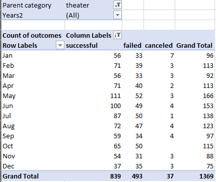
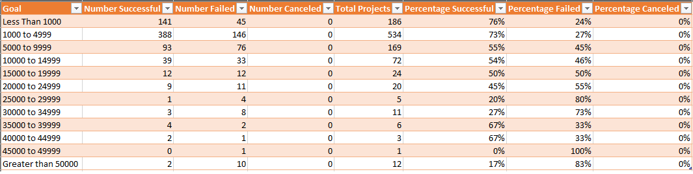
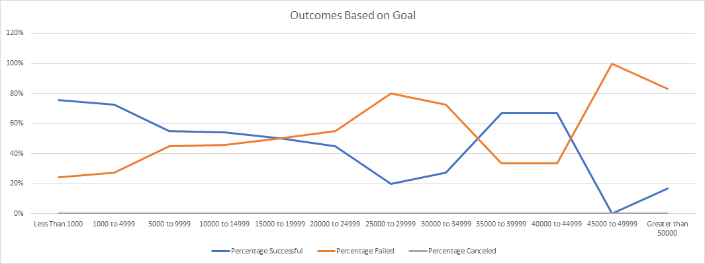
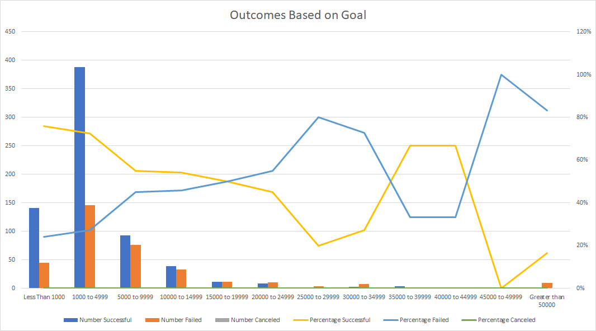

# Kickstarting with Excel

## Overview of Project

Louise tried to use fundraising campaigns to raise money for her play Fever. She was able to raise a considerable amount of fund for her play quite quickly. In order to understand how to increase the possibility of success, an analysis has been performed on the Kickstarter dataset which contains information of a large number of different campaigns. 

### Purpose

The goal of this project is to analyze the Kickstarter Excel sheet that contains the information about different fundraising campaigns in order to find out how their launch dates and their funding goals are correlated to the campaign outcomes. Visualizations are used to represent the results and provide insights.

## Analysis and Challenges

This analysis emphasized on the following factors that have impact on the success rate of a campaign.
- Launch Date
- Goals

### Analysis of Outcomes Based on Launch Date

In order to find out when is the best time to launch a fundraising campaign, an analysis was conducted to see which launch months have the highest success rate. Pivot table was used to filter and organize the data. Only campaigns under “theater” categories were considered for most relevance in this analysis because Louise’s campaign is categorized as “play” under “theater”. The pivotable fields were set as the following.

 It can be noted that throughout the years, the total number of campaigns launched in each months does not vary significantly. The numbers of successful campaigns launched in May, June, and July, however, are remarkably greater than the numbers of those launched in other months. This can also be depicted in the line chart below.

From the line chart, it can be noticed that the number of successful campaigns peaked in May. Therefore, the best time to launch a campaign that is categorized as “theater” is in May as it has the highest possibility to reach its goal.

### Analysis of Outcomes Based on Goals

Another important factor that affects the success rate of a campaign is the goal. In this analysis, the campaign dataset was filtered by their outcomes, goals, and subcategories using “COUNTIFS” function in excel. A table was formulated as shown below.

A line chart was generated based on the table and is shown below.

As the line chart above depicts, the campaigns with goals that range from $0 to $999 and from $1,000 to $4,999 have the highest success rates (76% and 73%). However, the number of campaigns launched with goals in these ranges must also be taken into consideration to ensure that the success rates are statistically significant. An improved cluster chart was generated to include the number of campaigns with goals in different ranges.

From the chart above, it can be seen that the numbers of successful campaigns with goals that are less than $1,000 and from $1,000 to $4,999 are also the greatest among all the ranges. Therefore, a fundraising campaign that is categorized as “play” is most likely to succeed if its goal is under $5,000.

### Challenges and Difficulties Encountered

One thing that was not considered in both analyses discussed above is the trend of success rate over the past decades. The data discussed in the previous analyses goes back to 1970. It is very likely that how the launch dates and goals affect the success rate has changed. A more sophisticated analysis that takes the consideration of the trend in recent years should be conducted.

## Results

- What are two conclusions you can draw about the Outcomes based on Launch Date?

1.	Based on the analysis performed above, it can be concluded that campaigns that are categorized as “play” are more likely to be successful if they are launched in months such as May, June, and July. 
2.	The numbers of “play” campaigns that failed or were canceled do not vary significantly over a year, despite noticeable changes on the total number of “play” campaigns launched in different months.

- What can you conclude about the Outcomes based on Goals?

Campaigns that are categorized as “play” with goals under $5,000 are more likely to be successful.

- What are some limitations of this dataset?

One of the limitations of this dataset is that it does not show how fast funds were raised for each campaign. Although it shows the start and end dates of each campaign, whether most money was raised within the first 10% of the whole time period or the money raised was evenly spread across the whole duration is not shown. This could be valuable information for Louise because it is important to know at what point she should put more effort on the fundraising campaign. 

- What are some other possible tables and/or graphs that we could create?
