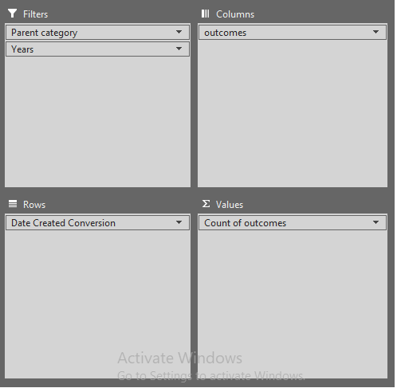
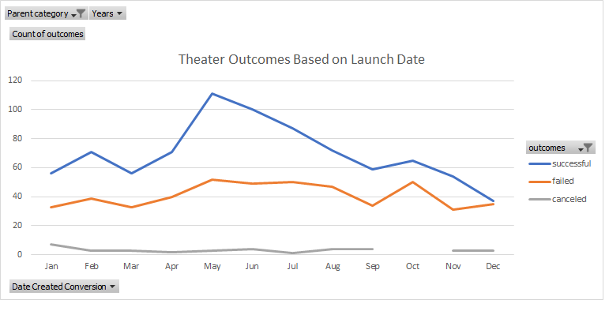

# Kickstarting with Excel

## Overview of Project

Louise tried to use fundraising campaigns to raise money for her play Fever. She was able to raise a considerable amount of fund for her play quite quickly. In order to understand how to increase the possibility of success, an analysis has been performed on the Kickstarter dataset which contains information of a large number of different campaigns. 

### Purpose

The goal of this project is to analyze the Kickstarter Excel sheet that contains the information about different fundraising campaigns in order to find out how their launch dates and their funding goals are correlated to the campaign outcomes. Visualizations are used to represent the results and provide insights.

## Analysis and Challenges

This analysis emphasized on the following factors that have impact on the success rate of a campaign.
- Launch Date
- Goals

### Analysis of Outcomes Based on Launch Date

In order to find out when is the best time to launch a fundraising campaign, an analysis was conducted to see which launch months have the highest success rate. Pivot table was used to filter and organize the data. Only campaigns under “theater” categories were considered for most relevance in this analysis because Louise’s campaign is categorized as “play” under “theater”. The pivotable fields were set as the following.

It can be noted that throughout the years, the total number of campaigns launched in each months does not vary significantly. The numbers of successful campaigns launched in May, June, and July, however, are remarkably greater than the numbers of those launched in other months. This can also be depicted in the pivot chart below.

### Analysis of Outcomes Based on Goals

### Challenges and Difficulties Encountered

## Results

- What are two conclusions you can draw about the Outcomes based on Launch Date?

- What can you conclude about the Outcomes based on Goals?

- What are some limitations of this dataset?

- What are some other possible tables and/or graphs that we could create?
